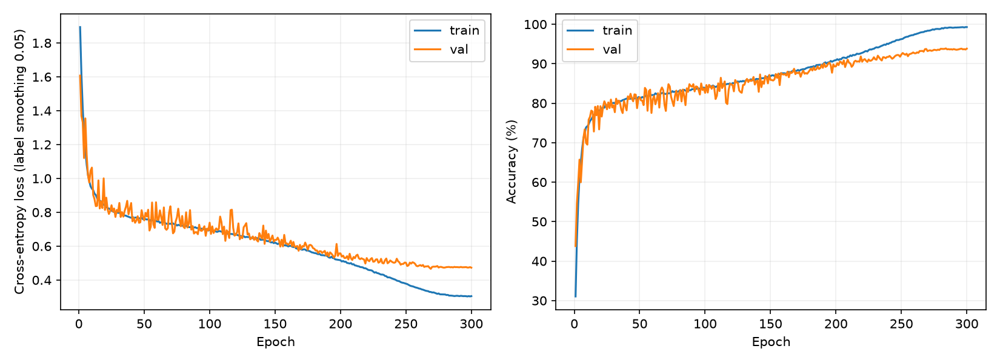
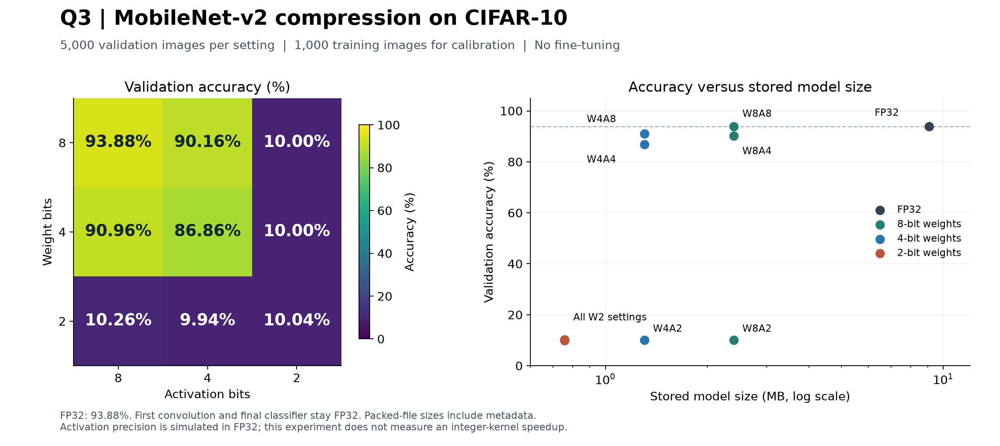
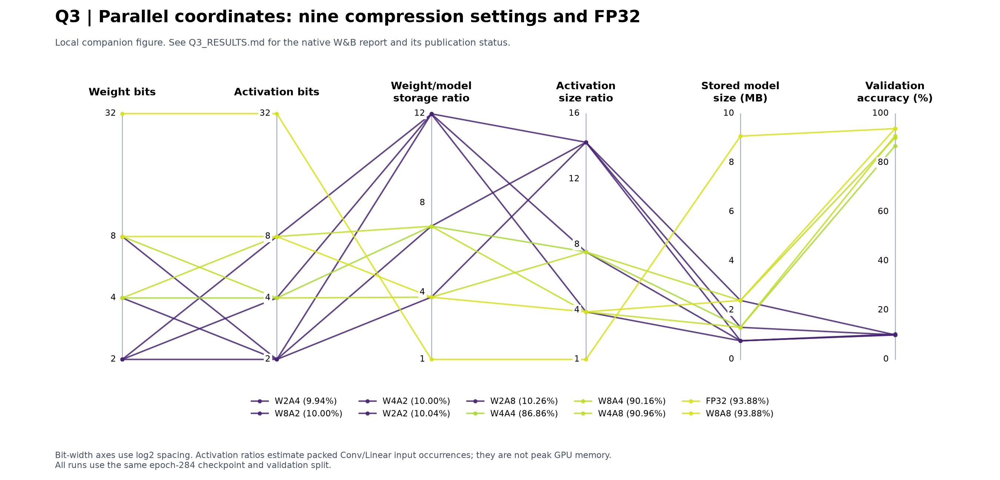

# MobileNet-v2 on CIFAR-10

CS6886 - System Engineering for Deep Learning | Assignment 2

Surya Harshith Balla | IIT Madras | 8 September 2026

## Q1. Training baseline

### (a) Data preparation

CIFAR-10 was split into 45,000 training, 5,000 validation and 10,000 test images. A seeded permutation keeps 4,500 training and 500 validation images per class. RGB mean (0.491840, 0.482541, 0.446820) and standard deviation (0.247051, 0.243542, 0.261692) were computed from the training split only.

Training transforms: reflect padding of 4 pixels, random 32 x 32 crop, horizontal flip (p = 0.5), tensor conversion, normalization and random erasing (p = 0.25, area 0.02-0.15, aspect ratio 0.5-2, fill 0). Validation and test use only tensor conversion and normalization.

### (b) Model and training strategy

| Setting | Value |
| --- | --- |
| Model | torchvision MobileNet-v2, trained from scratch; width 1.0; dropout 0.2; 10 output classes |
| CIFAR-10 change | First convolution stride 1; remaining stage strides unchanged; 2,236,682 parameters |
| BatchNorm | epsilon = 1e-5; momentum = 0.1 |
| Training | 300 epochs; batch 128; SGD, momentum 0.9, Nesterov |
| Learning rate | 0.1; 5-epoch linear warmup, then cosine decay to 1e-5 |
| Regularization | Weight decay 5e-4, excluding BN/bias; label smoothing 0.05; gradient clipping at norm 5 |
| Execution | Seed 42; AMP during training; FP32 evaluation; deterministic cuDNN |

### (c) Test accuracy, curves and failure modes

The checkpoint with the highest validation accuracy was epoch 284: 93.88% validation and 92.64% test top-1 accuracy (9,264 / 10,000). Test cross-entropy was 0.2849. The interrupted run was resumed with its optimizer and random states.



Figure 1. Training and validation curves over 300 epochs. Both plotted losses use label smoothing 0.05; the final test loss is unsmoothed.

Final-epoch training accuracy was 99.28% and validation accuracy was 93.82%. This gap suggests some overfitting, although training uses augmentation. A 99% training score alone is insufficient to judge it; the held-out results and curves matter. Only one seed was trained, so run-to-run variation was not measured.

## Q2. Model compression implementation

### (a) Configurable method and design

The implementation is in manual_compression.py. Weight and activation precision can each be set to 2, 4, 8 or 32 bits. It uses tensor operations, explicit rounding/clipping and bit shifts; no ready-made compression or quantization API is called. All compressed settings reuse the trained baseline without fine-tuning.

Weights use a separate symmetric scale for every output channel. This lets channels with different ranges, including depthwise filters, use their available precision. For b-bit weights and output channel c:

```powershell
L = 2**(b - 1) - 1
s[c] = max(abs(W[c])) / L
q[c] = clip(round(W[c] / s[c]), -L, L)
W_hat[c] = s[c] * q[c]
```

An all-zero channel uses scale 1. Signed codes are shifted by L before packing. Two 4-bit codes or four 2-bit codes share one byte. This symmetric scheme has three signed levels at 2 bits; it does not use all four possible bit patterns.

Activation ranges are collected at Conv/Linear inputs using 1,000 training images without augmentation, after weight quantization. Each location uses one affine scale and zero point. The observed range is extended to include zero:

```powershell
Q = 2**b - 1
s = (high - low) / Q
z = clip(round(-low / s), 0, Q)
q = clip(round(x / s + z), 0, Q)
x_hat = (q - z) * s
```

A zero-width range uses scale 1. Min/max calibration is simple to reproduce, but outliers can widen the range and reduce precision. Very low bit-widths can then accumulate rounding and clipping errors.

### (b) Layers and exceptions

Adjacent Conv/BatchNorm pairs are folded in evaluation mode: multiply each filter by gamma / sqrt(running_variance + epsilon), and adjust the bias using the running mean and beta. The BatchNorm module is then replaced by an identity. All intermediate Conv/Linear weights are quantized, including pointwise and depthwise convolutions.

The first convolution (features.0.0) and final classifier (classifier.1) weights and inputs stay FP32. Biases stay FP32. Activation hooks quantize the other Conv/Linear inputs; residual additions and other arithmetic run in FP32. Flags allow quantizing the edge layers or disabling BN folding. These exceptions stay fixed throughout Q3.

### (c) Storage overhead

| Part of final W4A8 file | Bytes |
| --- | --- |
| Packed weight codes | 1,094,448 |
| FP32 per-channel weight scales | 68,096 |
| Raw FP32 edge weights and biases | 122,920 |
| Header, including activation ranges, scales and zero points | 20,033 |
| Total actual file size | 1,305,497 |

The .mq file contains a 4-byte signature, 8-byte header length, JSON header and tensor payload. All are counted above. Activation storage estimates additionally use a compact 4-byte scale and 4-byte zero point per quantized location. The actual JSON representation is already included in the model file size; the two ratios describe different storage quantities.

## Q3. Compression results

### (a) Compression levels

The 3 x 3 grid varies weight and activation precision over 8, 4 and 2 bits. All nine settings start from the epoch-284 checkpoint. Calibration uses 1,000 training images, 100 per class (seed 42). Evaluation uses the same full 5,000-image validation split, 500 per class (order seed 43). Calibration and validation indices are saved and disjoint. No test images are used here.

### (b) Accuracy comparison

| Setting | Val. acc. (%) | Drop (pp) | Size (MB) | Model ratio | Activation ratio |
| --- | --- | --- | --- | --- | --- |
| FP32 | 93.88 | 0.00 | 9.084 | 1.00x | 1.00x |
| W8A8 | 93.88 | 0.00 | 2.400 | 3.78x | 3.90x |
| W8A4 | 90.16 | 3.72 | 2.399 | 3.79x | 7.57x |
| W8A2 | 10.00 | 83.88 | 2.399 | 3.79x | 14.25x |
| W4A8 | 90.96 | 2.92 | 1.305 | 6.96x | 3.90x |
| W4A4 | 86.86 | 7.02 | 1.305 | 6.96x | 7.57x |
| W4A2 | 10.00 | 83.88 | 1.305 | 6.96x | 14.25x |
| W2A8 | 10.26 | 83.62 | 0.758 | 11.98x | 3.90x |
| W2A4 | 9.94 | 83.94 | 0.758 | 11.99x | 7.57x |
| W2A2 | 10.04 | 83.84 | 0.758 | 11.99x | 14.25x |

Model ratio uses 9,083,592 bytes of original parameters and buffers divided by the complete packed file size. It includes BN folding and every storage overhead; it is the metric named weight_compression_ratio in the Q3 JSON/W&B runs. The separate weights-only calculation is given in Q4. Activation ratios are estimates of packed Conv/Linear input occurrences, not peak GPU memory.



Figure 2. Validation accuracy across the grid and its relation to saved model size.

W8A8 keeps the measured 93.88% validation accuracy at 2.400 MB. W4A8 gives 90.96% at 1.305 MB, while W8A4 gives 90.16% with a larger reduction in activation storage. W4A4 drops to 86.86%. Every setting using 2-bit weights or activations is close to 10% chance accuracy, so its larger storage reduction is not useful here.

Each packed file was reloaded before evaluation. Reloaded logits matched the corresponding pre-export model exactly on a validation batch. This checks serialization; it does not mean a compressed model produces the same predictions as FP32.

## Q3(b). W&B Parallel Coordinates chart

Ten finished runs, one per setting including FP32, are logged to W&B. The report contains a native Parallel Coordinates panel with six axes: weight bits, activation bits, model storage ratio, activation storage ratio, model size in MB and validation accuracy.

[Open the native W&B Parallel Coordinates chart](https://wandb.ai/harshith7946-indian-institute-of-technology-madras/cs6886-assignment2-q3/reports/Q3---MobileNet-v2-compression-results--VmlldzoxNzg4ODQ3OQ==)

Project: harshith7946-indian-institute-of-technology-madras/cs6886-assignment2-q3



Figure 3. Local companion plot of the same ten runs. This figure was drawn with Matplotlib; the native W&B panel is available through the link above.

The uploaded run configurations and numerical results were checked against the local results. The saved W&B report was also reloaded through the Reports API to verify that the native six-axis panel exists. The report URL and run links are recorded in wandb_online_manifest.json.

Higher compression does not always preserve useful accuracy. The 2-bit settings reduce storage most but perform near chance. Among settings with at least 90% validation accuracy, W4A8 has the smallest stored model. This validation-based rule is used for the one final configuration in Q4.

These results use one baseline and one calibration subset. No repeated-seed study, integer-kernel timing or runtime-memory benchmark was done. Stored weights are packed, but inference decodes them to FP32 and simulates activation quantization in floating point.

## Q4. Compression analysis

Chosen configuration: W4A8. It is the smallest saved model among the settings with at least 90% validation accuracy. The choice and file hash were saved in selection.json before the test set was evaluated. The following measurements all refer to this one configuration.

### (a) Weight compression ratio

Original Conv/Linear weights occupy 8,810,240 bytes. After compression, their packed codes, scales and FP32 edge weights occupy 1,217,200 bytes. Conservatively charging the entire 20,033-byte file header to weights gives:

```powershell
Weight ratio = 8,810,240 / (1,217,200 + 20,033)
             = 7.12x
```

This ratio includes weight scales and metadata overhead. BN parameters and biases are excluded from the weights-only numerator and tensor payload. Their contribution is included in the complete model measurement below.

### (b) Activation compression ratio and measurement

For one 32 x 32 image, input shapes were recorded at every Conv/Linear location. Summing all occurrences gives 2,177,536 FP32 bytes. Using 8 bits at the compressed locations and 32 bits at the two protected inputs gives 557,440 packed bytes. There are 51 quantized locations, adding 51 x 8 = 408 bytes for scales and zero points.

```powershell
Activation ratio = 2,177,536 / (557,440 + 408)
                 = 3.90x
```

An input used by multiple layers is counted at each occurrence. This measures estimated aggregate activation storage, not simultaneously live tensors or peak memory. The current inference code keeps arithmetic in FP32, so it does not realize this activation-memory saving at runtime.

### (c) Quantized model accuracy

| Measurement | Value |
| --- | --- |
| Validation top-1 accuracy used for selection | 90.96% |
| Final test top-1 accuracy | 90.13% (9,013 / 10,000) |
| Baseline test top-1 accuracy | 92.64% |
| Test accuracy decrease | 2.51 percentage points |
| Quantized test cross-entropy | 0.3783 |

The compressed model's lowest class accuracy is cat (72.3%); automobile is highest (95.3%). The saved predictions and confusion matrix allow checking these class results. No further configuration was selected using these test outcomes.

### (d) Final model size

The actual packed file is 1,305,497 bytes, or 1.305497 MB (about 1.31 MB; decimal MB). Compared with 9,083,592 original state-tensor bytes, the complete model storage ratio is 6.96x. This includes the overhead table in Q2(c), and is separate from the weights-only ratio in Q4(a).

## Q5. Reproducibility and repository

### (a) Code organization

| File | Purpose |
| --- | --- |
| prepare_data.py | Download, class-balanced split and training-only normalization |
| train_baseline.py | Training, validation selection, checkpointing and resume |
| manual_compression.py | Quantization, BN folding and packed model save/load |
| run_compression.py | Training-only calibration and Q3 validation sweep |
| evaluate_final.py | Record the final selection and evaluate test accuracy |
| report_q3.py / build_report.py | W&B panel, figures, PDF and editable answers |

Comments explain the scale calculations, packing, layer exceptions and data separation. The repository includes the best baseline checkpoint, packed models, saved splits, metrics and training curves. Eight regression tests passed, including bit packing, compression reload and checkpoint write handling. The standalone preparation script reproduced every saved split index and the original normalization values exactly.

### (b) Commands, environment and seeds

The run used Windows, Python 3.14.3, torch 2.14.0+cu126, torchvision 0.29.0+cu126, NumPy 2.5.2 and an RTX 3050 Laptop GPU (4 GB). W&B uses wandb 0.29.0 and wandb-workspaces 0.4.11. The README gives setup, full training/resume, the nine-setting sweep, final evaluation and chart publication commands. Requirement files pin the direct dependencies; environment-lock.txt records the full environment.

From the repository root, after creating and activating the virtual environment:

```powershell
python -m pip install -r requirements-notebook.txt
python -m pip install -r requirements-q3.txt
python -m pip install -r requirements-report.txt
python prepare_data.py --download
python -m unittest test_manual_compression test_training_io
python report_q3.py --wandb-mode none
python evaluate_final.py --device cuda `
    --output-dir artifacts/final_recheck
```

The last command reloads and tests the chosen model in a fresh output folder. Training and data splitting use seed 42. Calibration uses seed 42 and validation ordering uses seed 43. cuDNN deterministic mode is enabled; benchmark mode is disabled. Exact results may still vary across hardware and versions.

### (c) GitHub repository

[https://github.com/harshith0518/cs6886-assignment-2-mobilenetv2](https://github.com/harshith0518/cs6886-assignment-2-mobilenetv2)

The PDF is the Moodle submission file. Repository and W&B access must be available to the evaluator if either is private.

### References

[torchvision: MobileNet-v2 source](https://github.com/pytorch/vision/blob/main/torchvision/models/mobilenetv2.py)

[CIFAR-10 dataset](https://www.cs.toronto.edu/~kriz/cifar.html)

[Jacob et al.: Quantization and Training of Neural Networks (2018)](https://arxiv.org/abs/1712.05877)

[W&B: Parallel Coordinates panels](https://docs.wandb.ai/models/app/features/panels/parallel-coordinates)
